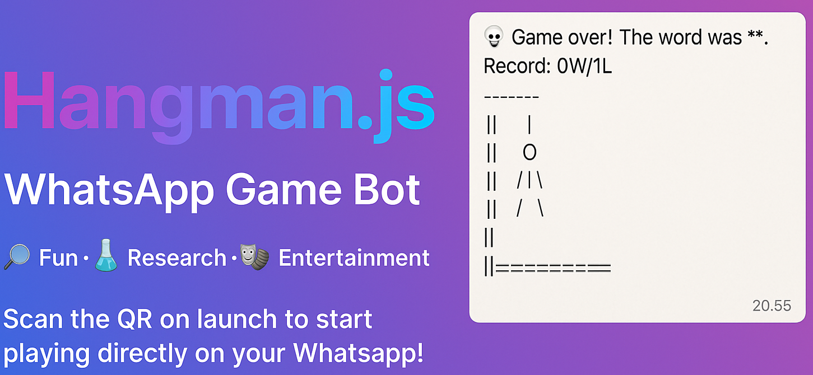
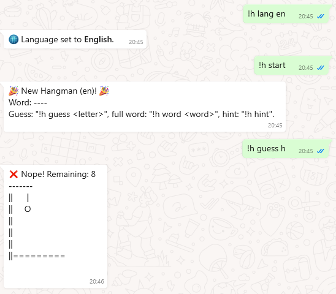
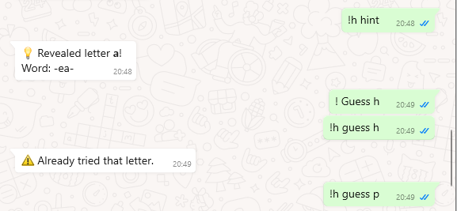
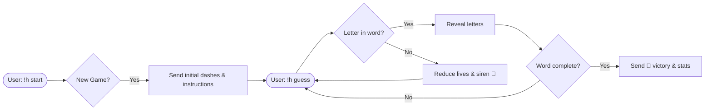

# 🎉 Hangman.js — WhatsApp Hangman Bot 🚨

Experience a playful and educational **Hangman game inside WhatsApp**!  
Built with **Node.js** and powered by **venom-bot**, Hangman.js turns any WhatsApp account into an interactive multilingual game bot.

---

## 📚 Index

- [⚠️ Disclaimer](#️-disclaimer)
- [🏅 Key Features](#-key-features)
- [⚙️ Quick Start](#️-quick-start)
- [🔑 Login via QR Code](#-login-via-qr-code)
- [🌐 Language Selection](#-language-selection)
- [📱 Bot Commands](#-bot-commands)
- [📸 Screenshots](#-screenshots)
- [🔄 Game Logic](#-game-logic)
- [📜 License](#-license)

---

## ⚠️ Disclaimer

Hangman.js is provided **for fun, research, and entertainment purposes only**.  
This project is **not affiliated with WhatsApp or Meta**.

By using this tool, you agree to:

- ✅ Use it within WhatsApp’s [terms of service](https://www.whatsapp.com/legal/terms-of-service).
- 🚫 Avoid unsolicited messaging or spamming.
- 🤝 Respect user privacy and consent at all times.

This bot is meant for safe experimentation, learning, and fun.

---

## 🏅 Key Features

| Badge | Feature |
|---|---|
|  | ⚡ Powered by Node.js |
|  | 🤖 Real-time WhatsApp automation |
|  | 🌐 Multi-language word lists |
| 🖼️ | 🎨 Malios Dark ASCII Art with gallows |
| 🏆 | 📊 Per-user win/loss tracking |
| 💡 | 🧠 Hint system for tough rounds |
| 🔐 | 🔑 Secure local session using QR code |

---

## ⚙️ Quick Start

```bash
git clone https://github.com/maliosDark/whatsapp-hangman-bot.git
cd whatsapp-hangman-bot
npm install
````

Ensure Chrome/Chromium is installed at:

```bash
/usr/bin/google-chrome-stable
```

If not installed:

```bash
sudo apt update && sudo apt install -y chromium-browser
```

---

## 🔑 Login via QR Code

When you run:

```bash
npm start
```

The bot will **automatically launch a QR code** in the terminal.

📲 To connect:

1. Open **WhatsApp** on your phone.
2. Go to `Settings → Linked Devices`.
3. Tap **Link a Device**.
4. Scan the terminal QR code.

Once scanned, your WhatsApp session becomes the **Hangman bot**. It stays active until:

* You log out manually.
* You delete the `./session-data` folder.

---

## 🌐 Language Selection

Hangman.js supports **bilingual gameplay** with independent word lists:

* 🇪🇸 `!h lang es` → Español (palabras en español)
* 🇬🇧 `!h lang en` → English (English word list)

Set your language before starting or mid-game. The bot will respond in your chosen language and update the word bank accordingly.

📝 **Example**:

```text
!h lang en
!h start
```

---

## 📱 Bot Commands

| Command             | Description                         |
| ------------------- | ----------------------------------- |
| `!h start`          | 🎉 Start a new game                 |
| `!h guess <letter>` | ✏️ Guess a single letter            |
| `!h word <word>`    | 🏆 Guess the entire word            |
| `!h hint`           | 💡 Reveal one letter                |
| `!h status`         | 🔎 View current progress            |
| `!h score`          | 📊 Show your win/loss record        |
| `!h lang es\|en`    | 🌐 Switch between Español / English |
| `!h help`           | 📖 Display this help menu           |

---

## 📸 Screenshots



*Starting a fresh round!*



*Each guess brings you closer to victory!*

---

## 🔄 Game Logic



---

## 📜 License

This project is released under the **MIT License**.
You are free to use, modify, distribute, and build upon this work.

> For commercial projects or integrations with WhatsApp Business API, please consult Meta’s [developer policies](https://developers.facebook.com/policy/).

---
